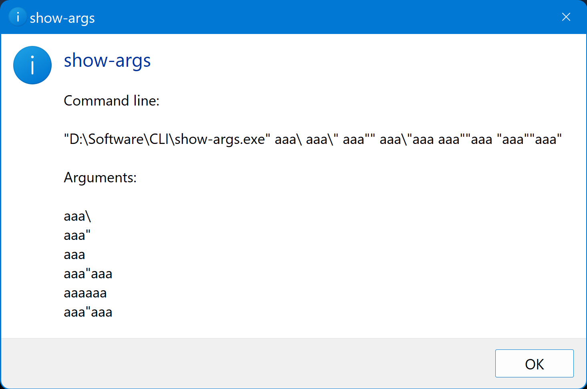

# About

Windows app that shows a message box with the received command line arguments.

It can be useful to debug complex command lines.

# Requirements

- Windows 7 or newer
- [.NET Desktop Runtime 6](https://dotnet.microsoft.com/en-us/download/dotnet/6.0)

# Screenshot

# Resources

- https://devblogs.microsoft.com/oldnewthing/20100917-00/?p=12833
- https://docs.microsoft.com/en-us/cpp/c-language/parsing-c-command-line-arguments?view=msvc-170
- https://docs.microsoft.com/en-us/archive/blogs/twistylittlepassagesallalike/everyone-quotes-command-line-arguments-the-wrong-way
- https://docs.microsoft.com/en-us/powershell/module/microsoft.powershell.core/about/about_quoting_rules
- https://docs.microsoft.com/en-us/powershell/module/microsoft.powershell.core/about/about_special_characters
